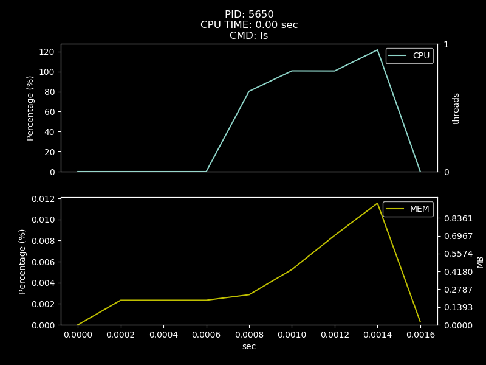
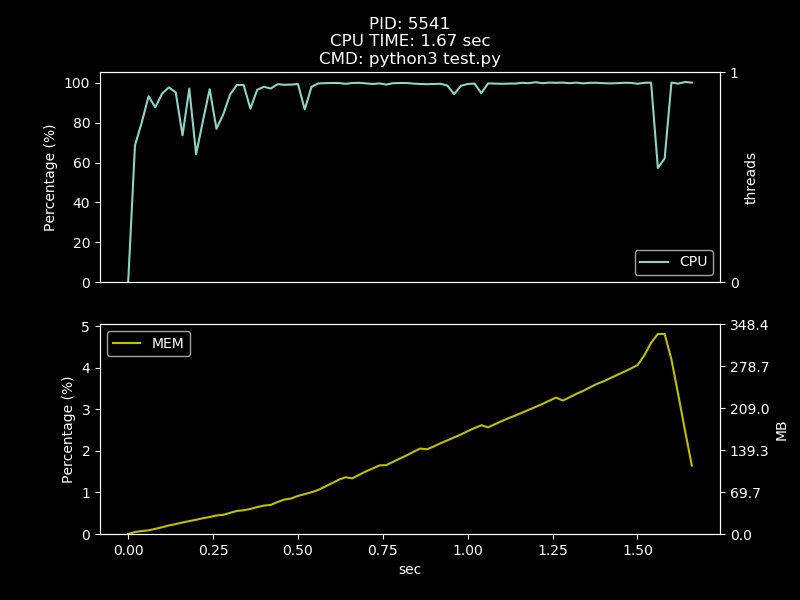
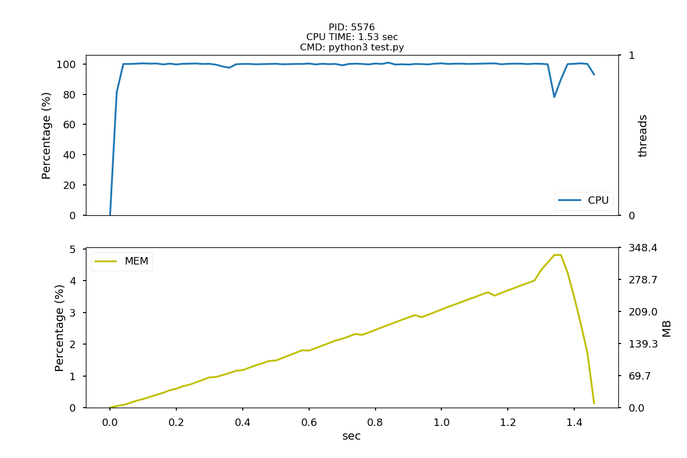

# monitor2plot
A python program for monitoring CPU/MEM of your job, and save it as a plot.

## Prerequisite
* Python 3

## Installation
``` shell
git clone https://github.com/shanghungshih/monitor2plot.git
```

## Parameters
- `--cmd` : the command you would like to monitor
- `--output` : output plot name (default: $PWD/monitor2plot.png)
- `--interval` :  time interval for accessing CPU time (default: 0.01 sec)
- `--theme` : theme for the plot: dark/light (default: dark)

## Quick start
- Run the program with your command
##### ex. ls
```python
python3 monitor2plot.py  -c "ls" -i 0.0001
```



##### ex. python program
```python
python3 monitor2plot.py  -c "python3 test.py"
```


##### ex. python program with light theme
```python
python3 monitor2plot.py  -c "python3 test.py -t light"
```
